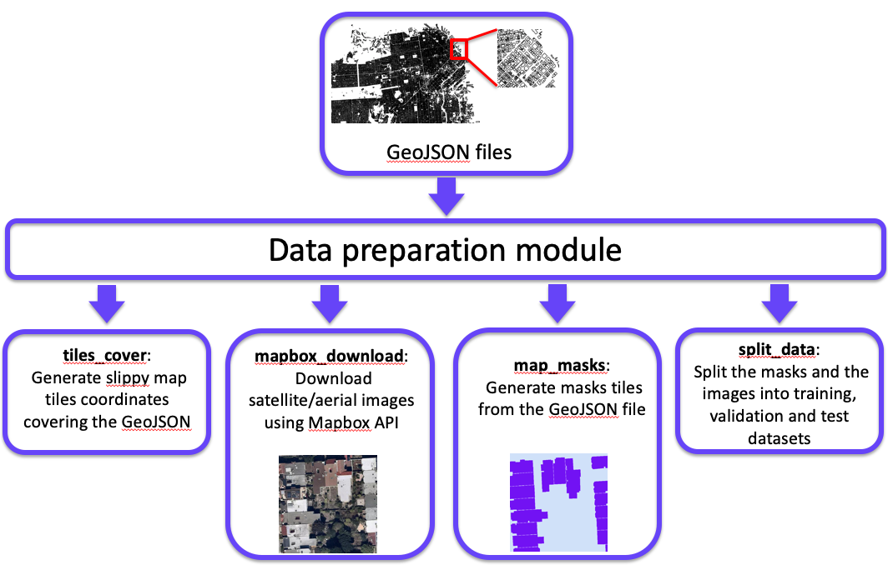
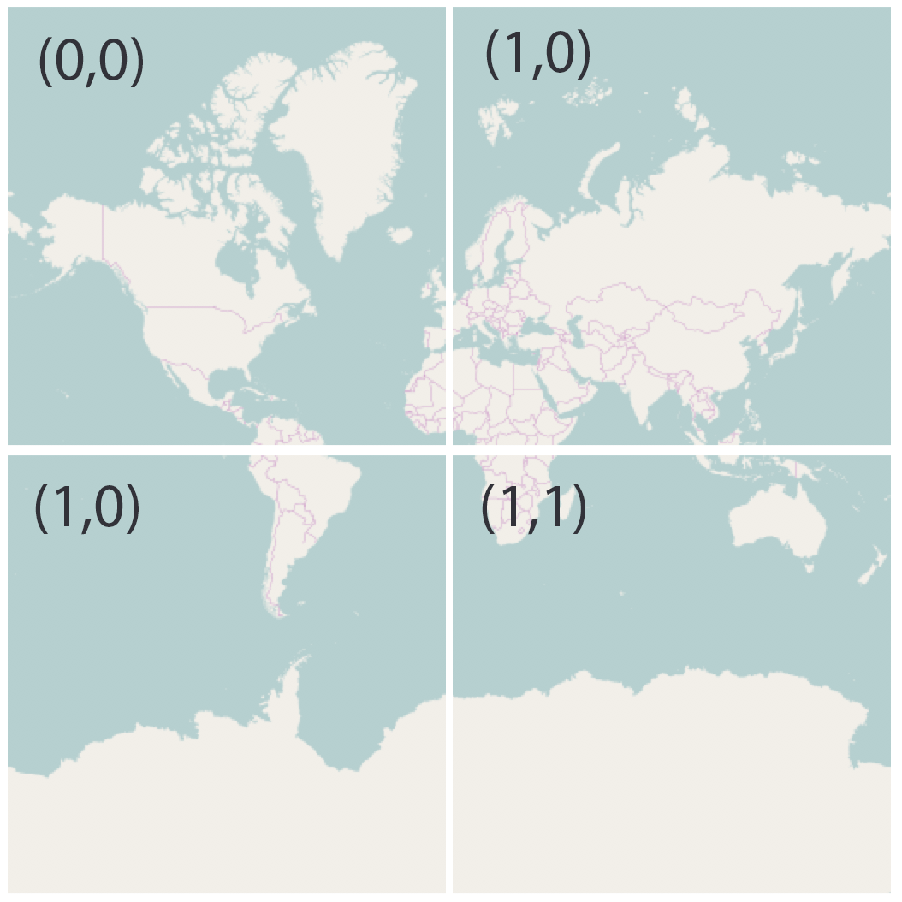
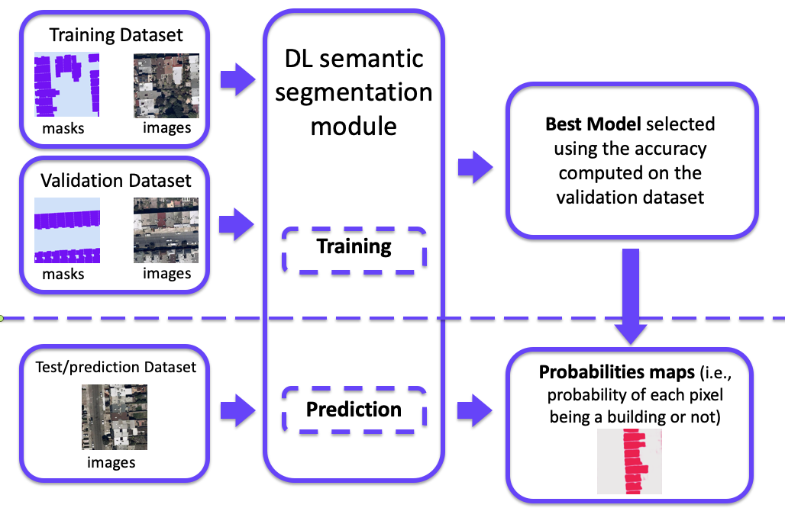
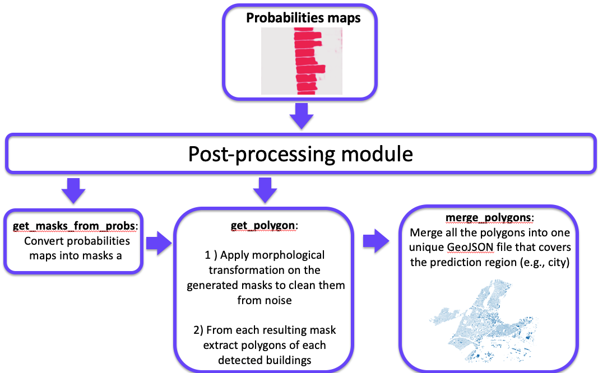

# AutoBFE

***

Table of Contents:
----
+ [**Introduction**](#introduction)
+ [**Installation**](#installation)
+ [**Data preparation module**](#Data-preparation-module)
+ [**Semantic Segmentation module**](#Semantic-Segmentation-module)
+ [**Post-processing module**](#Post-processing-module)
+ [**Accuracy evaluation**](#Accuracy-evaluation)
+ [**References**](#references)


## Introduction

In this version of AutoBFE, we have initiated the development of a replicable workflow to extract building footprints from satellite/aerial images using state of the art deep learning image segmentation algorithms. This workflow is composed of three modules, which are described in further detail:
- Data preparation module, which aims to generate training data with a very limited manual effort using openly available data sources:
    -  Automatic generation of training features masks by querying cities/counties footprints GIS open data 
    -  Automatic extraction of Satellite/aerial tiles using Mapbox api. These tiles are covering the geographical areas that are available from the cities/counties footprints GIS open data

- Deep learning modeling, which aims to establish an easy modeling pipeline to reproduce the analysis and test new deep learning architectures:
    -  Standardized training pipeline
    -  Two state of the art fully convolutional neural network architecture models (i.e., Unet and DeeplabV3+)

- Post-processing of model results module, which aims to generate results that are easily transformable into data formats that that is compatible with required inputs to existing measure-identification tools:
    - Prediction cleaning (i.e., removal of noisy prediction)
    - Prediction transformation (i.e., convert predictions that are pixel-based masks into polygons with geographic coordinate)

AutoBFE is a toolbox that allows others to easily reproduce our approach, that offers transparency in modeling solutions, and that facilitates continuous improvement via incorporation of alternative deep learning algorithms and/or expansion of the training data (e.g., adding more cities into the training dataset).

## Installation

From sources:
```bash
git clone https://github.com/LBNL-ETA/AutoBFE
cd AutoBFE
python setup.py install
```

From github:

```bash
pip install git+https://github.com/LBNL-ETA/AutoBFE
```

## Data preparation module

<p align="center">
    
</p>


Automatic generation of data with a limited manual effort using openly available footprint GIS data. This GIS data can be gather from several cities/counties that are promotting open data initiatives. Using the Mapbox Raster Tiles API The aerial/Satellite images are collected from the satellite layer of the [Mapbox](https://docs.mapbox.com/) Maps, which provide high resolution satellite images. This imagery data is a compilation of several commercial and open data sources, is color-corrected and stored in raster format which is a pixel-based data format “that efficiently represent continuous surfaces” [[Mapbox](https://docs.mapbox.com/)].

For each GIS building footprints dataset (i.e., GeoJSON file) that can be collected from cities and counties open data platforms, the data preparation module will create a list of tiles coordinates that cover the specific region. These coordinates follow the Mapbox Raster Tiles API default format, which is the slippy maps standard that defines each tile by the zoom level and the tile coordinates. The zoom level defines the scale of the map and the tile coordinates (at a specific zoom level) are identified by Cartesian coordinates, starting in the top left of the map (i.e., Mercator projection of the earth). For example, at zoom 1 the earth map is divided into four tiles (Figure below). At each higher zoom level the number of tiles increases by a factor of four. Thus, each tile is retrieved by providing the API three numbers, i.e., z for the zoom level, and x and y for the Cartesian coordinates).

<p align="center">
    
</p>

<p align="center"><em >Illustration  of a slippy map at zoom 1 (<a href="https://developers.planet.com/tutorials/slippy-maps-101/">source</a>)</em></p>

### Example of data preparation module usage

Detecting nearby adjacent buildings is a verry challenging problem because the model need to learn the separation between them. One can use two method to force the model to learn this separation: the first method is to scaling down the size of each polygon in the 'ground truth' GeoJSON file this can be done easly in python using geopandas package as follow:

```python
gdf_fp = gpd.read_file("Building_Footprints.geojson")
gdf_fp['geometry'] = [gpd.GeoSeries(x).scale(xfact=.96, yfact=.96)[0] for x in gdf_fp['geometry']]
gdf_fp.to_file(driver = 'GeoJSON', filename= path + "Building_Footprints_scaled.geojson")
```
in this example we scalled down the polygons by 4% in each direction.

The second method uses the distance weighted loss function indroduced in the [Unet paper](https://arxiv.org/abs/1505.04597)
(equation #2). This method will be further described at the end of this section. 
#### Instantiating data preparation class

```python
from dataprep.getdata import SatMask

path = "/Data/"
features_path = path + "Building_Footprints_scaled.geojson"
tiles_cover_path = path + "bldgs.csv"
zoom = 19
size = 512
url_map = "https://api.mapbox.com/v4/mapbox.satellite/{z}/{x}/{y}@2x.jpg?access_token=YOUR_MAPBOX_ACCESS_TOKEN"
image_format = "jpg"
mask_format = "png"
sat_path = path + "images/"
num_workers = 10
masks_path = path + "masks/"

satmask = SatMask(url_mapbox = url_map, image_format = image_format, 
                  mask_format = mask_format, tiles_cover_path = tiles_cover_path, 
                  sat_path = sat_path, gis_path = features_path, masks_path = masks_path, 
                  zoom = zoom, size = size ,num_workers = num_workers)
```

#### Generates Slippy Map tiles format covering the GeoJSON features file
The `tile_cover` method generates a csv file that lists all the [Slippy Map](https://developers.planet.com/tutorials/slippy-maps-101/) tiles that cover the GeoJSON features file

```python
satmask.tiles_cover()
```

#### Download aerial/satellite images using Mapbox API

The `mapbox_download` method uses the csv file of the Slippy Map tiles generated in the previous step and downloads the corresponding aerial/satellite images. Note that to download the images you will need to have a Mapbox account and generate a token.

```python
satmask.mapbox_download()
```

#### Generate features masks
The `map_masks` method generate mask images from the GeoJSON features file that correspond to each Slippy Map tile. 
```python
colors  = ['lightblue', 'purple']
satmask.map_masks(colors)
```

#### Split the dataset into training, validation and test samples

The `split_tiles_cover` method is used to randomly split the Slippy Map tiles coordinates generated by `tile_cover` method into training, validation and test samples. The method creates csv files that list the tiles of each sample. 

```python
train_tiles_cover_path = path + "train_SF_bldgs.csv"
val_tiles_cover_path = path + "val_SF_bldgs.csv"
test_tiles_cover_path = path + "test_SF_bldgs.csv"

satmask.split_tiles_cover(rtrain = 0.5, rval = 0.5, rtest = 0,
                          train_tiles_cover_path = train_tiles_cover_path, 
                          val_tiles_cover_path = val_tiles_cover_path, 
                          test_tiles_cover_path = test_tiles_cover_path)
```

The `split_data` method split the data into three separate folders (i.e., train, val and test)

```python
train_val_test_path = path + "train_val_test/"

satmask.split_data(train_val_test_path = train_val_test_path)
```

At the end of all these steps the user will have a `Data` folder that will be structured as follow:

```
Data
└───images
└───masks
└───train_val_test
│   └───train
│   │   ├── images
│   │   └── masks
│   └───val
│   │   ├── images
│   │   └── masks
│   └───test
│   │   ├── images
│   │   └── masks

```
As you can see the images and masks are duplicated. To delete the folders `images` and `masks` that include all the tiles one can use the following:

```python
satmask.delete_no_split()
```
This will delete `Data/images` and `Data/masks` folders


#### Distance weighted loss function 

The [Unet paper](https://arxiv.org/abs/1505.04597) introduced a way to penalize loss function that uses distance weight maps in order to force the model to learn more the the small separation borders that represent touching buildings. These distance weight maps are precomputed for each ground truth mask tile using the following function:

```python
from dataprep.distance import *
distance_path = "/Data/train_val_test/train/"
distance_weight(path)
```
Note that the distance weight maps are computed only for tiles that are in the training subset. At the end of this step the user will have a `Data` folder that will be structured as follow:

```
Data
└───train_val_test
│   └───train
│   │   ├── images
│   │   └── masks
│   │   └── distances
│   └───val
│   │   ├── images
│   │   └── masks
│   └───test
│   │   ├── images
│   │   └── masks

```

## Semantic Segmentation module

This module provide a standardized and easy modeling pipeline to reproduce analysis and test new deep learning architectures. 

+ Include state-of-the-art deep learning model for semantic segmentation: 
DeeplabV3+

+ Scalable: Training can be done on a Multi-GPU hardware

+ Include multiple:
    + Loss functions, 
    + Accuracy metrics 
    + Data augmentation tools


<p align="center"></p>
Data from the training sample are used to fit the models using different hyperparameters. The models are then used to predict footprints from the validation sample. The model-hyperparameter combination(s) that exhibit the best performance can then be evaluated for overall accuracy using data from the testing sample.

### Example of Model training process
Training the Deep Neural Network model and generating the predictions can be done using commande line or by running a bash script similar to:

#### Training
```bash
#!/bin/bash

 CUDA_VISIBLE_DEVICES=0 python train.py --backbone resnet  \
 --lr 0.0001 --workers 6 --epochs 160 \
 --batch-size 16 --gpu-ids 0 --experiment SF_test --eval-interval 1 --dataset building \
 --loss-type dicewce \
 --optim Adam \
 --sigma 5 \
 --w0 10 \
 --train_path '/Data/train/' \
 --val_path '/Data/val/' 
```
#### Prediction

```bash
#!/bin/bash

CUDA_VISIBLE_DEVICES=0 python predict.py --backbone resnet \
 --workers 8 \
 --test-batch-size 16 --gpu-ids 0 --best_model '/AutoBFE/results/building/all_dicewce/best_model.pth.tar' \
 --test_path '/Data/' 
 ```

## Post-processing module

<p align="center"></p>

The feature masks that are produced using the neural network model need to be transformed to become meaningful footprint features that can be input into existing measure identification analysis tools. This will involve using image processing algorithms such as morphological operation (to remove noise in the prediction mask), contouring, and polygonization (generate GIS polygons from pixel-based mask). Developing this postprocessing is an ongoing work.


### Example of postprocessing module usage

The starting point for applying the postprocessing module are the probability images files produced by the prediction of the best model obtained during the training process.


### Generate masks from probability files

The `get_masks_from_probs` function generate mask images from the probability files that correspond to each Slippy Map tile. 

```python
from postproc.postprocessing import get_masks_from_probs

probs_path = ['/Data/probs/']
masks_path = '/Data/masks_probs'

get_masks_from_probs(probs_path, masks_path, probs_threshold=0.85, num_workers=8)
```

Note that the `probs_path` is a list. This is because a user who has several model can ensemble the results (i.e., merge the prediction).

### Generate buildings polygons

The `get_polygons` function generate a geojson file that has all the extracted polygons from the predicted mask images generated in the preious step.  

```python
from postproc.postprocessing import get_polygons

pred_masks_path = '/Data/masks_probs'
polygons_path = '/Data/masks_probs/polygons.geojson'

get_polygons(pred_masks_path,polygons_path)
```

### Merge polygons

The `merge_polygons` function take as an input the geojson file produced by `get_polygons` and merge the adjacent polygon based on the their closeness (i.e., minimum distance between the polygons). The output is a geojson file.

```python
from postproc.postprocessing import merge_polygons

polygons_path = '/Data/masks_probs/polygons.geojson'
merged_polygons_path = '/Data/poly_merged.geojson'

merge_polygons(polygons_path,merged_polygons_path,.5)
```

## Accuracy evaluation

Now that we have the prediction geojson file, we can compute the accuracy metrics after the post proceesing step. However, since we have have scaled down the size of each polygons by 4% in each direction, we need to do the reverse action (scale up). This can be done as follow:

```python
import geopandas as gpd

gdf_merged = gpd.read_file( '/Data/poly_merged.geojson')
gdf_merged['geometry'] = [gpd.GeoSeries(x).scale(xfact=1.04, yfact=1.04)[0] for x in gdf_merged['geometry']]

```

In order to be consistent with the accuracy metrics that we have computed during the modeling step we generate a new set of mask images that correspond to the same Slippy Map tiles. 

```python
from dataprep.getdata import SatMask

path = "/Data/"
features_path = path + "poly_masks_merged_exp_1_04.geojson"
tiles_cover_path = path + "bldgs.csv"
zoom = 19
size = 512
mask_format = "png"
num_workers = 10
pred_masks_path = path + "masks_pred_merged_exp_1_04/"

satmask = SatMask(mask_format = mask_format, tiles_cover_path = tiles_cover_path, 
                  gis_path = features_path, masks_path = pred_masks_path, 
                  zoom = zoom, size = size ,num_workers = num_workers)

colors  = ['lightblue', 'purple']
satmask.map_feature(colors)
```

To evaluate the accuracy we use  `postproc_evaluation` function as follow:

```python
from postproc.postprocessing import postproc_evaluation

masks_path = '/Data/masks'
pred_masks_path = '/Data/masks_pred_merged_exp_1_04'

postproc_evaluation(pred_masks_path,masks_path,2)
```